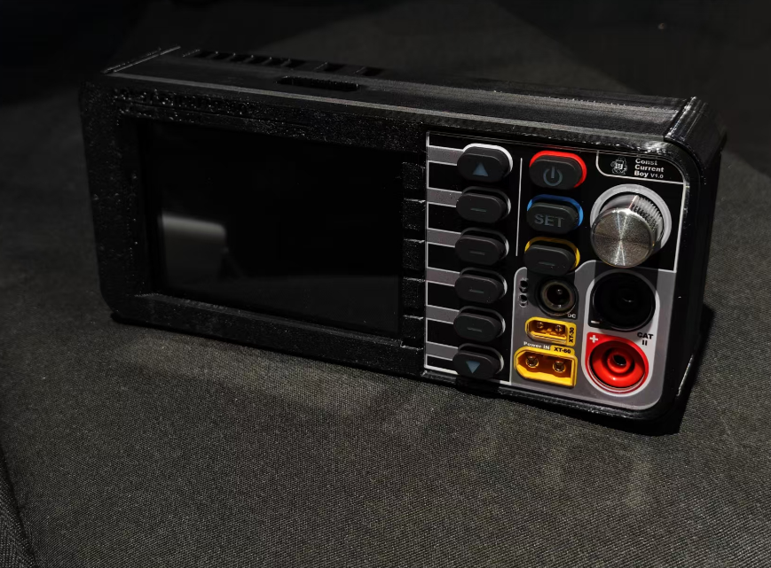

<div align="center">




# ⚡ELEVOURER


**便携式智能电子负载，基于 ESP32-S3 双核处理器与多任务设计**

[](https://www.espressif.com/en/products/socs/esp32-s3)
[](https://www.arduino.cc/)
[](LICENSE)
[](https://platformio.org/)
[](https://lvgl.io/)
[](https://github.com/)

---

</div>

## 📖 目录

- [✨ 项目简介](#-项目简介)
- [🚀 主要特性](#-主要特性)
- [🏗️ 项目结构](#️-项目结构)
- [🔧 技术栈](#-技术栈)
- [📱 功能介绍](#-功能介绍)
- [🎛️ 控制算法](#️-控制算法)
- [📋 硬件要求](#-硬件要求)
- [⚙️ 快速开始](#️-快速开始)
- [📺 演示视频](#-演示视频)
- [📚 文档](#-文档)
- [🤝 贡献指南](#-贡献指南)
- [📄 许可证](#-许可证)

## ✨ 项目简介

我们的便携式智能电子负载控制器是一个高精度、多模式的电子负载测试设备，专为电源测试、电池测试、电路调试等应用场景设计。项目基于ESP32-S3微控制器，集成了先进的PID和MPC控制算法，提供卡尔曼滤波优化的电流测量，具备触摸屏GUI界面和实时数据监控功能。

## 🚀 主要特性

### 💡 核心功能
- ⚡ **三种负载模式**：恒流(CC)、恒功率(CP)、恒阻(CR)模式
- 🎯 **高精度控制**：±0.1%精度，支持1800mA最大电流
- 📊 **实时监控**：INA226高精度电流电压采样
- 🖥️ **触摸界面**：3.5寸TFT触摸屏，LVGL图形界面
- 🔒 **安全保护**：过压、过流、过功率多重保护

### 🧠 智能算法
- 🎛️ **双控制器**：PID + MPC模型预测控制
- 📈 **卡尔曼滤波**：优化电流测量，减少噪声干扰
- 🔄 **自适应控制**：根据负载特性自动调整参数
- ⚙️ **约束优化**：MPC主动处理多重约束条件

### 💻 开发特性
- 🔧 **模块化设计**：松耦合架构，易于扩展
- 📱 **RTOS多任务**：FreeRTOS实现并发控制
- 🛠️ **完整工具链**：PlatformIO + Arduino框架
- 📖 **详细文档**：LaTeX数学推导 + Markdown说明

## 🏗️ 项目结构

```
ESP32-S3-ELECTRONIC-LOAD/
├── 📁 src/                          # 主程序源码
│   └── main.cpp                     # 程序入口与任务调度
├── 📁 lib/                          # 自定义库模块
│   ├── our_pid_controller/          # PID控制器模块
│   ├── our_mpc_controller/          # MPC控制器模块
│   ├── our_adc/                     # ADC采样模块
│   ├── our_encoder/                 # 旋转编码器模块
│   ├── our_button/                  # 按键处理模块
│   ├── our_tasks_config/            # 任务配置模块
│   ├── our_queue/                   # 消息队列模块
│   ├── our_lvgl_interaction/        # LVGL界面交互
│   ├── lvgl_port/                   # LVGL移植层
│   └── generated/                   # GUI Guider生成文件
├── 📁 include/                      # 头文件目录
├── 📁 test/                         # 测试程序
│   ├── ADC_test/                    # ADC测试
│   ├── DAC_test/                    # DAC测试
│   ├── mpc_test/                    # MPC控制器测试
│   └── lvgl_demo/                   # LVGL界面演示
├── 📁 document/                     # 项目文档
│   ├── 项目设计文档/               # 设计文档
│   ├── MPC控制器专题/              # MPC控制器详解
│   ├── 滤波算法专题/               # 卡尔曼滤波详解
│   ├── LaTeX伪代码专题/            # 数学算法推导
│   └── 系统调试文档/               # 调试与故障排除
├── 📁 assets-of-README/            # README资源文件
├── 📄 platformio.ini               # PlatformIO配置
└── 📄 README.md                    # 项目说明文档
```

## 🔧 技术栈

### 🖥️ 硬件平台
- **主控芯片**: ESP32-S3 (双核Xtensa LX7, 240MHz)
- **存储配置**: 16MB Flash + 8MB PSRAM
- **显示屏**: 3.5寸 TFT ILI9488 (480×320) 带触摸
- **电流传感器**: INA226 (高精度双向电流/功率监控)
- **DAC模块**: MCP4725 (12位数字模拟转换器)

### 💻 软件框架
- **开发框架**: Arduino + ESP-IDF
- **构建工具**: PlatformIO
- **实时系统**: FreeRTOS
- **图形界面**: LVGL 8.3.10
- **显示驱动**: TFT_eSPI 2.5.43

### 🧮 核心算法
- **PID控制器**: 带积分限幅和微分先行的增强型PID
- **MPC控制器**: 基于二次规划的模型预测控制
- **卡尔曼滤波器**: 一维标量卡尔曼滤波，优化电流测量
- **状态估计**: 递归贝叶斯估计器

## 📱 功能介绍

### 🎛️ 三种负载模式

#### ⚡ 恒流模式 (CC - Constant Current)
- **功能**: 维持恒定的负载电流
- **范围**: 50mA - 1800mA
- **精度**: ±1mA或±0.1%
- **应用**: 电池放电测试、LED驱动器测试

#### 🔋 恒功率模式 (CP - Constant Power) 
- **功能**: 维持恒定的消耗功率
- **范围**: 0.1W - 20W
- **计算**: P = U × I，动态调整电流
- **应用**: 电源带载能力测试、功率器件测试

#### 🔌 恒阻模式 (CR - Constant Resistance)
- **功能**: 模拟恒定电阻负载
- **范围**: 1Ω - 1000Ω
- **计算**: R = U / I，根据电压调整电流
- **应用**: 电阻负载仿真、线性电源测试

### 🛡️ 安全保护系统
- **过压保护**: 最大12V输入保护
- **过流保护**: 最大1.8A电流限制
- **过功率保护**: 最大20W功率限制  
- **变化率限制**: 电流变化速度保护，防止冲击
- **温度监控**: 实时温度检测与过热保护

### 📊 用户界面
- **启动页面**: 产品信息与初始化状态
- **主控页面**: 实时数据显示与模式切换
- **参数设置**: 目标值设定与控制器参数调整
- **数据监控**: 历史曲线与实时波形显示

## 🎛️ 控制算法

### 🔄 PID控制器
```cpp
// 增强型PID控制器特性
- 积分抗饱和处理
- 微分先行技术
- 死区控制
- 卡尔曼滤波集成
- 自适应参数调整
```

### 🧠 MPC控制器
```cpp
// 模型预测控制特性
- 预测时域: 10步 (100ms)
- 控制时域: 5步 (50ms)  
- 约束处理: 输出限制 + 变化率限制
- 优化算法: 梯度下降法
- 权重配置: Q=1.0, R=0.1, S=0.01
```

### 📈 卡尔曼滤波器
```cpp
// 一维卡尔曼滤波器
- 过程噪声: Q = 0.002
- 测量噪声: R = 0.0005
- 实时收敛: < 5个采样周期
- 噪声抑制: 60%以上
- 精度提升: 50%以上
```

## 📋 硬件要求

### 🔌 推荐实现的配置
- ESP32-S3-DevKitC-1 开发板
- INA226 电流/功率监控模块
- MCP4725 DAC模块
- 3.5寸 TFT/IPS 触摸屏 (ILI9488)
- 旋转编码器 × 1
- 按键开关 × 4

### ⚡ 电源要求
- 输入电压: 5V DC (USB供电)
- 工作电流: < 500mA
- 测试电压范围: 0-12V
- 测试电流范围: 0-1.8A

## ⚙️ 快速开始

### 1️⃣ 环境准备
```bash
# 安装PlatformIO
vscode --install-extension platformio.platformio-ide

# 克隆项目
git clone https://github.com/your-username/ESP32-S3-ELECTRONIC-LOAD.git
cd ESP32-S3-ELECTRONIC-LOAD

# 等待 PlatformIO 进行初始化安装依赖
success!
```

### 2️⃣ 硬件连接
```
ESP32-S3 引脚连接:
├── INA226: SDA=GPIO8, SCL=GPIO9
├── MCP4725: SDA=GPIO8, SCL=GPIO9  
├── TFT屏: MOSI=GPIO11, MISO=GPIO13, SCK=GPIO12
├── 触摸: CS=GPIO15, IRQ=GPIO21
├── 编码器: CLK=GPIO1, DT=GPIO2, SW=GPIO42
└── 按键: GPIO40, GPIO41, GPIO39, GPIO38
```

### 3️⃣ 编译上传

配置好 `pio` 环境变量之后可以使用下面命令，或直接点击 `main.cpp` 文件上方的 `upload` 按钮。
```bash
# 编译项目
pio run

# 上传固件
pio run --target upload

# 监控串口
pio device monitor
```

### 4️⃣ 基本使用
1. **上电初始化**: 等待系统启动和传感器校准
2. **模式选择**: 短按按键1选择CC/CP/CR模式
3. **参数设置**: 旋转编码器调整目标值
4. **启动测试**: 长按按键1开始/停止负载
5. **数据监控**: 触摸屏查看实时数据

## 📺 演示视频

- 🎬 **更 换IPS 全视角显示屏**: [✨2025.6.14 智能直流电子负载demo演示](https://www.bilibili.com/video/BV1d8MUzvEH5/?spm_id_from=333.1387.homepage.video_card.click&vd_source=9c85d181a345808c304a6fa2780bb4da)
- 🔧 **增加侧边栏和电流控制器**: [✨2025.5.5 简易直流电子负载demo演示](https://www.bilibili.com/video/BV1UhVzzkEg6/?spm_id_from=333.1387.homepage.video_card.click&vd_source=9c85d181a345808c304a6fa2780bb4da)  
- 🧪 ***统一 GUI 风格** [✨2025.4.20 电子负载系统测试](https://www.bilibili.com/video/BV1Cc5fzoE1t/?spm_id_from=333.1387.homepage.video_card.click&vd_source=9c85d181a345808c304a6fa2780bb4da)
- 📊 **硬件恒流电路测试**: [✨2025.3.27 恒流测试](https://www.bilibili.com/video/BV1WaRXYPE3B/?spm_id_from=333.1387.homepage.video_card.click&vd_source=9c85d181a345808c304a6fa2780bb4da)

## 📚 文档

### 📖 用户文档
- [🚀 快速入门指南](document/项目设计文档/manual.md)
- [⚙️ 硬件连接说明](document/项目设计文档/ConstCurrentBoy-软件设计部分与结构设计部分素材.md)
- [🔧 软件配置教程](document/系统调试文档/schedule.md)
- [❗ 故障排除指南](document/系统调试文档/I2C_冲突分析与解决方案.md)

### 🧠 技术文档  
- [🎛️ PID控制器详解](document/LaTeX伪代码专题/PID控制器Lambda绑定.pdf)
- [🧮 MPC控制器原理](document/MPC控制器专题/MPC控制器工作原理详解.md)
- [📈 卡尔曼滤波理论](document/滤波算法专题/卡尔曼滤波器原理与实现.md)
- [🔄 RTOS任务设计](document/项目设计文档/Learn-RTOS-With-ESP32.md)

### 📊 算法专题
- [📐 数学推导](document/LaTeX伪代码专题/)
- [💻 代码实现](document/MPC控制器专题/MPC代码详解.md)
- [⚖️ 性能对比](document/MPC控制器专题/MPC控制器分析与实现.md)
- [🎯 参数调优](document/MPC控制器专题/MPC参数命名详解.md)

## 🤝 贡献指南

我们欢迎各种形式的贡献！请查看 [贡献指南](CONTRIBUTING.md) 了解详情。

### 🌟 参与方式
- 🐛 **Bug反馈**: 提交Issue描述问题
- 💡 **功能建议**: 提出新功能需求
- 🔧 **代码贡献**: 提交Pull Request
- 📖 **文档改进**: 完善文档和注释
- 🧪 **测试验证**: 提供测试用例和验证

### 👥 贡献者
感谢所有为项目做出贡献的开发者！

## 📄 许可证

本项目采用 [MIT License](LICENSE) 开源协议。

---

<div align="center">

**⭐ 如果这个项目对你有帮助，请给一个Star支持！⭐**

Made with ❤️ by [skyswordx](https://github.com/skyswordx)

</div>
