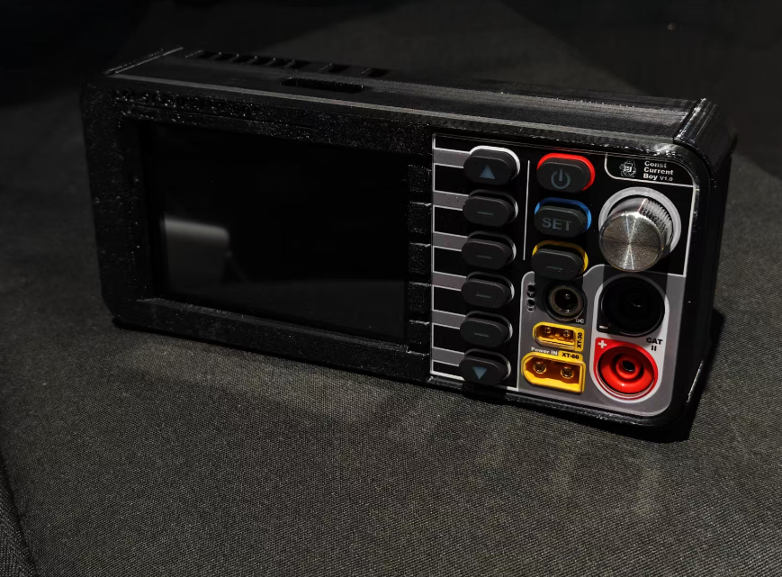

<div align="center">




# ELEVOURER


便携式智能电子负载，基于 ESP32-S3 双核处理器与多任务设计

[](https://www.espressif.com/en/products/socs/esp32-s3)
[](https://www.arduino.cc/)
[](LICENSE)
[](https://platformio.org/)
[](https://lvgl.io/)
[](https://github.com/)

---

</div>

## 项目简介

本项目是便携式智能电子负载控制器，面向电源测试、电池放电测试与电路调试等场景。控制核心为 ESP32-S3，提供 CC/CP/CR 三种负载模式，搭配触摸屏 GUI 与实时数据监控。

说明：项目内包含 MPC 控制器代码，但目前仅完成实现，尚未完成系统级集成与完整测试验证；默认控制链路以 PID 为主。

## 主要特性

- 三种负载模式：恒流 (CC)、恒功率 (CP)、恒阻 (CR)
- 实时采样：INA226 电压/电流/功率监测
- 图形界面：3.5 寸 TFT 触摸屏 + LVGL
- 安全保护：过压、过流、过功率等保护逻辑
- 软件结构：FreeRTOS 多任务、模块化组件，便于扩展

## 项目结构

```
ESP32-S3-ELECTRONIC-LOAD/
├── src/                 # 主程序入口与任务调度
├── lib/                 # 组件库（PID/MPC/ADC/LVGL 等）
├── include/             # 头文件
├── test/                # 各模块测试与演示
├── document/            # 设计/调试/算法文档
├── assets-of-README/    # README 资源
├── platformio.ini       # PlatformIO 配置
└── README.md            # 项目说明
```

## 技术栈

- 硬件：ESP32-S3，INA226，MCP4725，3.5 寸 ILI9488 触摸屏
- 软件：PlatformIO + Arduino（结合 ESP-IDF 组件），FreeRTOS，LVGL
- 控制/滤波：PID，卡尔曼滤波；MPC 已实现但未完成集成与测试

## 硬件连接（默认示例）

```
ESP32-S3 引脚连接:
├── INA226: SDA=GPIO8, SCL=GPIO9
├── MCP4725: SDA=GPIO8, SCL=GPIO9
├── TFT屏: MOSI=GPIO11, MISO=GPIO13, SCK=GPIO12
├── 触摸: CS=GPIO15, IRQ=GPIO21
├── 编码器: CLK=GPIO1, DT=GPIO2, SW=GPIO42
└── 按键: GPIO40, GPIO41, GPIO39, GPIO38
```

## 快速开始

### 1. 环境准备
```bash
# 安装 PlatformIO
vscode --install-extension platformio.platformio-ide

# 克隆项目
git clone https://github.com/your-username/ESP32-S3-ELECTRONIC-LOAD.git
cd ESP32-S3-ELECTRONIC-LOAD
```

### 2. 编译与上传

配置好 `pio` 环境变量后可使用命令行，或在 VS Code 的 PlatformIO 面板中执行构建/上传。
```bash
# 编译项目
pio run

# 上传固件
pio run --target upload

# 监控串口
pio device monitor
```

### 3. 基本使用（示例）

1. 上电初始化：等待系统启动与传感器初始化
2. 模式选择：切换 CC/CP/CR
3. 参数设置：编码器调整目标值
4. 启停负载：按键控制开始/停止
5. 数据监控：触摸屏查看实时数据

## 演示视频

- 2025.6.14 智能直流电子负载 demo 演示：https://www.bilibili.com/video/BV1d8MUzvEH5/
- 2025.5.5 简易直流电子负载 demo 演示：https://www.bilibili.com/video/BV1UhVzzkEg6/
- 2025.4.20 电子负载系统测试：https://www.bilibili.com/video/BV1Cc5fzoE1t/
- 2025.3.27 恒流测试：https://www.bilibili.com/video/BV1WaRXYPE3B/

## 文档

更多设计说明、调试记录与算法推导见 `document/`。

## 贡献指南

欢迎提交 Issue / PR。详见 [贡献指南](CONTRIBUTING.md)。

## 许可证

本项目采用 [MIT License](LICENSE)。
