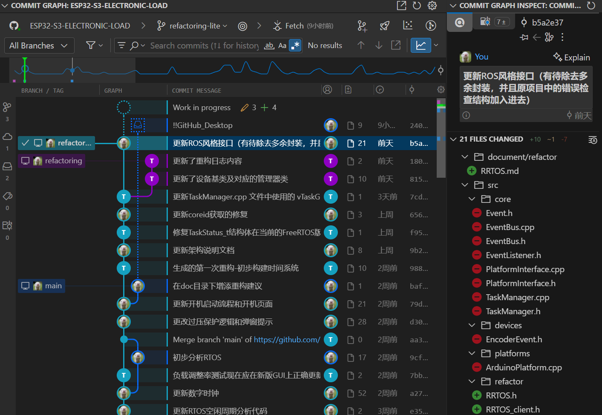
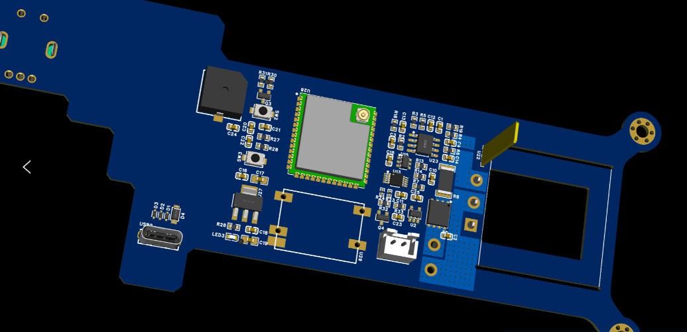
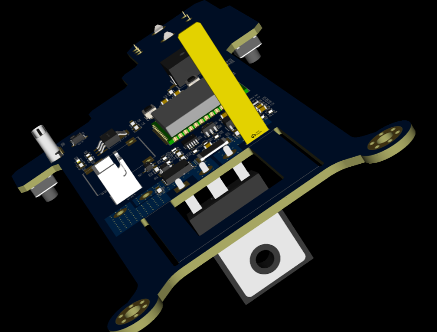
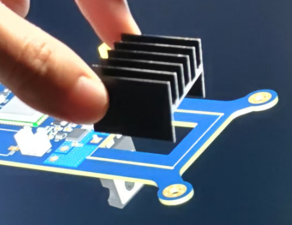
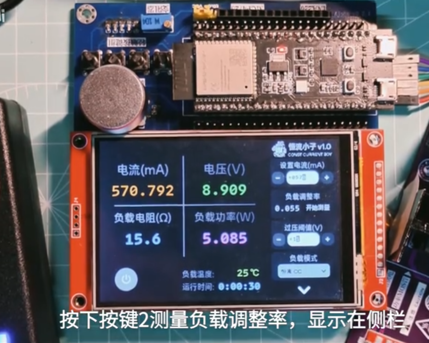

## 工作具体情况

### 5.3-5.17

### 终版结构方案与Layout布局

本周在硬件方面取得了重要进展，完成了**终版结构方案的设计以及PCB的Layout布局**。本次设计的核心目标是实现整机的轻薄化与小巧化。为此，我们对控制部分和功率部分的布局进行了细致且合理的规划。特别地，针对**功率部分的散热设计**进行了重点优化，通过合理的元器件布局和散热路径规划，确保在高负载情况下系统的稳定运行和良好的散热性能，为实现紧凑型结构提供了有力支持

### 代码重构与通信机制优化

软件方面，本周进行了代码重构，采用了发布订阅模式和事件总线来进行任务间的通信，这有助于降低代码耦合度，使软件结构更为清晰

### 录制调试视频

本周还录制了相关的调试视频，测试了包括各模块的协同工作实现恒流电子负载的各项功能指标的实际运行效果，可以更清楚的展示当前系统的运行状态和部分功能实现情况

### 存在问题与解决方案

#### 过压保护误触发问题

在调试过程中，注意到一个过压保护相关的小问题。具体表现为，当控制DAC输出从高阻态恢复时，偶尔会触发一次误报的过压保护。这个问题可能与硬件层面的瞬态响应有关，需要进一步分析。

## 下周计划

1. 针对过压保护问题，结合硬件原理进行分析，优化相关电路或调整软件判断逻辑。
2. 根据新的Layout方案，开始准备PCB打样和元器件采购。
3. 对整机结构的稳固性和可靠性进行进一步评估。

