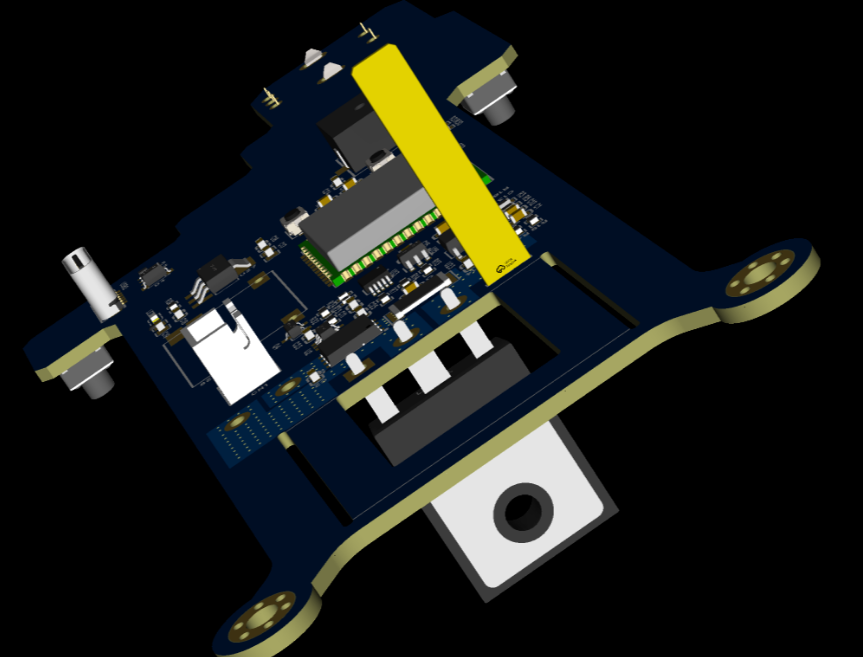
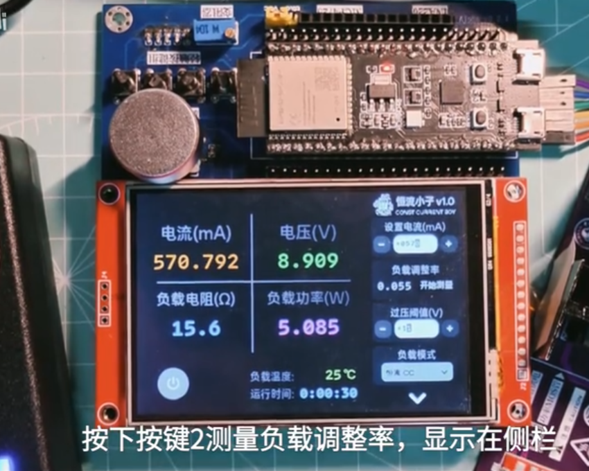

## 工作具体情况

### 5.3-5.17

### 代码重构与通信机制优化

本周在软件方面的主要进展是进行了代码的重构，核心在于优化了任务间的通信机制。我们引入了**发布订阅模式 (Publish-Subscribe Pattern)**，并启用了**事件总线 (Event Bus)**。这一改变旨在规范化通信内容，显著降低各任务模块之间的耦合度。通过这种方式，代码的整体结构变得更加清晰，可读性和可维护性得到提升，为后续功能的迭代和扩展打下了良好的基础

### 终版结构方案与Layout布局

硬件方面，本周也完成了终版结构方案的设计和PCB的Layout布局。对控制部分和功率部分的布局进行了合理规划，特别关注了功率部分的散热设计，目标是实现更轻薄小巧的整机结构

### 录制调试视频

本周录制了相关的调试视频，展示了当前系统的运行状态和部分功能实现情况。视频内容主要包括各模块的协同工作实现恒流电子负载的各项功能指标的实际运行效果

### 存在问题与解决方案

#### 过压保护误触发问题

在测试过程中，发现一个关于过压保护的小问题。当DAC（数模转换器）输出完全进入高阻态后再次恢复正常输出时，系统会偶尔误触发一次新的过压保护。初步分析可能是状态切换瞬间的电压波动导致，后续需要进一步排查和优化保护逻辑。

我们经过讨论和查阅资料，利用文档生产力工具进行了下面的初步分析

## 下周计划

1. 针对过压保护误触发问题，进行深入分析，定位具体原因并进行修复。
2. 继续完善基于发布订阅模式的各项功能模块，进行充分测试。
3. 开始准备下一阶段其他外设比如矩阵键盘的开发。