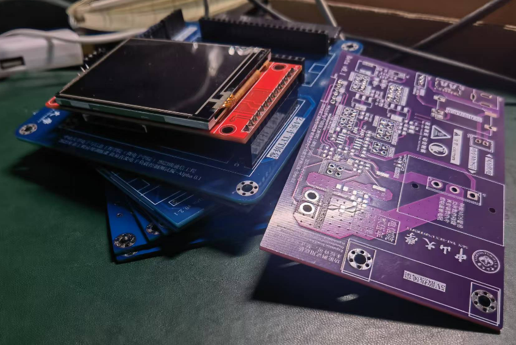

# 工作具体情况

## 3.22-3.28

所谓的条件编译调试是指为了应对模块上的 `DAC` 和 `INA226` 初始化参数不一样，使用条件编译来选择不同的初始化参数，避免了编译后固件无用体积的增大

然后初步绘制了一版简易的大屏 GUI，方便我们进行数据的数值显示和波形显示

之前的小屏触摸问题也确定确实是触摸驱动芯片可能坏了，我刷了 LVGL 的官方触摸示例程序，还是没有反应

配合新的一版控制板的上拉输入的按键，修改完善按键检测和消抖任务部分的代码，实现 4 个按键＋编码器按键的消抖识别，并且支持识别**长按和短按**，并且**把其中的编码器按键绑定了编码器读数的快慢模式**

> 这其中尝试了一系列方法，首先是没有消抖的检测，效果不好；然后使用消抖，但是是使用 while 阻塞式的扫描，效率也不好；最后使用了 RTOS 的定时器调度延时来实现消抖，效果很好

增加了一系列的 INA226 打印数据的接口，方便接下来和搭档一起去实验室调试恒流电路

## 3.29-4.2

3.29 号和搭档在实验室一起测试恒流控制部分的电路，并进行两板的联合调试测试

## 4.3-4.5

在这几天完善了之前的按键检测和条件编译测试，并把编码器的旋转值与 LVGL 的波形显示控件绑定在一起，还用剩下的按键实现了一个页面切换（考虑到触摸屏触摸识别效果不好，目前先使用按键进行页面切换）

并且还使用模板编写了一个 pid 库的框架
> 这个 pid 库在计算微分项的时候使用了小技巧预防了微分冲击，并且有合理的积分限幅
> 由于使用模板类进行编程，可以让用户自主绑定传感器获取数据的函数，有更多的兼容性

这是之前使用这个库整定直流编码器电机的截图

然后在尝试搭建串口在线调试，但是卡住在无法启用 ESP32 自带的 UART 接口，只能使用 `printf` 重定向

# 下周计划

这是我们目前迭代下来打的板子，已经打了 3 板控制板，图中蓝色的板子有我们上两个版本的

之后继续完善测试，然后完善 PID 控制逻辑调整 DAC 输出，之后设计简单的外壳与第一版功率测试板组成
原型机