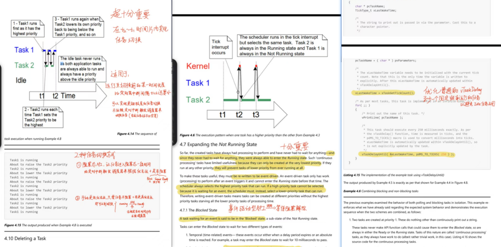

# 工作具体情况

## 5.3-4.24

### 通信模板设置

大致的思路是这样，希望可以基于 RTOS 整合出一套适用性强，适合直接在电赛中使用的队列通信接口

这是这个接口的具体实现，在未来的比赛中，可以直接把这份代码放到工程并且更改实际中使用的消息队列，按需调整警报类型和任务 id、任务描述类型中的元素即可

### RTOS 空闲任务周期分析

这几天细看了 RTOS 的官方文档，然后根据文档的任务调度时序图对我们现有的多任务调度系统进行分析

分析可知，在 CPU 0 上只有一个 LVGL 调度器，并且优先级是 0，会有一部分时间进到 idle 空闲任务，效率并没有提升到最大
### 移植数字时钟控件

这个控件并不是 LVGL 自带的，是在 gui-guider 那边预先设置的一个控件模板，直接移植 gui-guider 的代码会提示找不到数字时钟的实现，得要查找其依赖库并找到对应的代码实现

成功移植的效果如下

自动记录从开机到目前运行的总时间
# 下周计划

如果现在能做一套通用型比较强的调试与控制平台，应该电赛就可以方便很多
最起码 GUI 显示要彻底有个模板

其实 RTOS 任务框架就基本有这个雏形了
后面分清楚周期任务采样，还有隔一段时间进入的上层任务会更清晰一点

针对我们目前比如电赛的需求应该能抽象出一些具有通用型的结构
但是我们目前的任务之间的通信等结构完全是依赖于时下的需求确定的
还需要进一步重构代码，整合一个合理的接口

