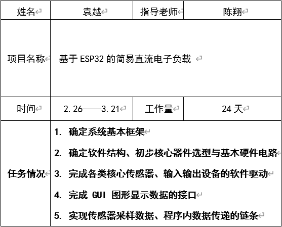
# 工作具体情况

## 1. 需求分析、组织分工一览

我和我的搭档何淼，首先调研了网络上和赛题（简易直流负载）的相关资料
在项目推进初期，商议了分别**从软件上和硬件上并行同步开发**的方案，具体分工如下

我的搭档初期主要负责直流控制功能部分的如何满足赛题需求的硬件设计和元件选型
- 将整个项目的电路板划分成两个模块，并分别进行绘制
	- (**已打板**)包含主控 MCU 控制板（含有受 MCU 控制的输入输出设备，如 TFT-LCD、旋转编码器、按键、LED 指示灯等等）
	- (**已仿真 + 投板**)主要是运放和 MOS 开关构成的恒流电路功率板
- **优先完成控制板的绘制、以便我进行软件开发，不用再使用信号电平不稳定的面包板＋杜邦线**
- 然后才是确定电流电压测量需求的硬件方案（先用 ADC、后面发现可以使用 IIC 和片外专业芯片完成更加精准的测量）
	- (**Done**) 结合网上的工程和资料，学习基于运放和 MOS 开关的恒流控制电路的原理
	- (**Done**) 结合网上的工程和资料，使用 Multisim 进行电路仿真、确定恒流电路具体硬件选型方案
	- (**ToDO**)

我初期负责利用 MCU 完成这个赛题在软件上的各项外设驱动、状态切换、以及数据显示需求
1. (**Done**) 使用 **ADC** 采样电流、电压数据，在程序中计算电子负载调整率
2. (**Done**) 使用 **QSPI** 硬件外设驱动 TFT-LCD 液晶屏。以便显示电子负载的各项数据
3. (**Done**) 移植 **LVGL 8.3** 版本的图形库，添加控件更加直观地显示电子负载的数据
4. (**Done**) 使用 **RTOS** 实时操作系统，**实时性地**协调数据采样和数据显示等**多任务**
5. (**Done**) 使用 **RTOS 中断机制**和软件滤波，处理**按键输入**进行电子负载的模式转换
6. (**Done**) 使用外设计数器采样**旋转编码器**的数据输入，以此来调节电子负载设定的恒定电流值
7. (**Done**) 利用 **IIC 与片外 DAC 进行通信**，利用外挂 DAC 实现共同的和更加精准的电压参考源，以达到良好且稳定的恒流负载效果
8. (**Done**) 使用**外挂的 PSRAM** 存放屏幕缓冲数据，以便提高 LVGL 的帧率，实现更流畅的画面
9. (**ToDO**) 在硬件功率板打板测试之后，使用 PID 闭环控制 DAC 输出电压给 MOS 管来达到更加精准的恒流效果

## 2. 我在软件上开发过程记录 & TroubleShooting

### 2.26-2.28

**在一开始**，我在**软件架构上**主要参考了莫工和老师推荐的嘉立创开源工程进行设计，如下图

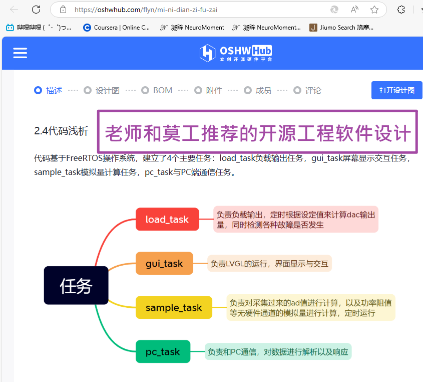

**这里我不同于开源的工程，我将软件上要实现的任务功能进行进一步的细化**
1. 补充 RTOS 中断任务，实现检测到故障时关闭 `DAC` 输出实现功率电路保护（如过压保护）
2. 增加更多的 `ADC` 通道采样任务，实现多通道多次高精度采样
3. 增加更多输入设备和相应的消息队列进行数据传递，比如按键中断任务切换模式、旋转编码器调节设定恒流值电流

**然后主控 MCU 的选择，我们手头上正好有 `ESP32S3` 开发板可以用于开发。之所以选择 `ESP32S3` 有如下几个原因**
1. 首先 `ESP` 系列本身就原生基于 `FreeRTOS` 系统，可以很方便的使用 RTOS 协调电子负载这种集数据采样、输出控制、数据显示等等多任务的调度
2. 其次，`ESP32S3` 自带的 `ADC` 采样精度可以满足赛题需求，然后其自带的双核系统可以更加方便地最大化 RTOS 带来的任务调度收益 
3. 然后 `ESP` 模组自带板载天线和 WiFi、蓝牙等模块，方便项目后期添加无线连接等功能
4. 然后因为 `ESP` 系列是国产芯片。基于这种芯片开发有利于拓展我们国产 MCU 的生态

> 实际上，莫工和老师推荐的开源工程就是基于 `FreeRTOS` 进行任务调度的，如果使用 `ESP` 的话，就不用再像那个工程一样移植 `FreeRTOS` 上，可以把时间节省下来，更高效地研发业务代码

**为了方便后期总结经验和进行复盘，在软件上我使用了 `github` 来托管整套工程代码和相关参考资料文档**
- **实现了历史版本记录。方便写周报**
- DeBug 时的切换版本调试
- 后期写周报、复盘反思、总结整理时便于查找到参考链接

仓库效果一览如下图
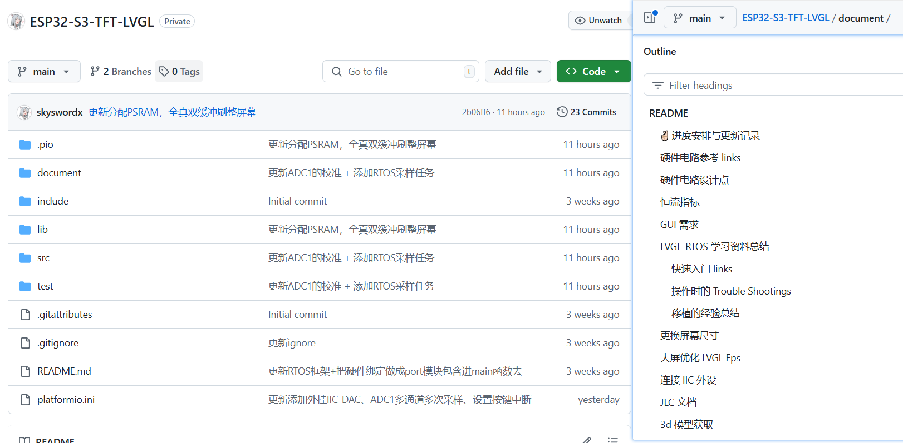

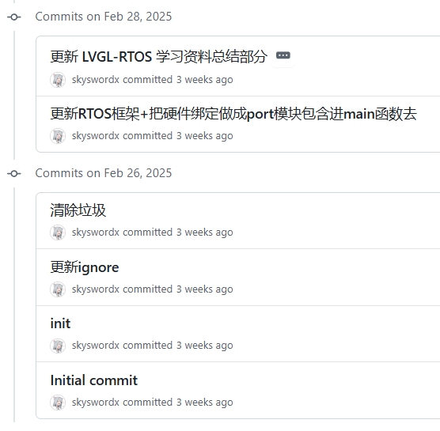
**下面介绍我在 2.25 到 2.28 这几天具体的工作**
- 首先是**熟悉开源项目中使用的 LVGL**，然后调研了选用 **320 x 240 TFT-LCD 显示屏**来显示，以及查找相关的显示驱动，整理了资料（见仓库文档 commit 记录）

- 然后学习怎么使用 RTOS，之前也没见过，然后结合网上的 Blog 和示例程序学习其中的**任务机制的 API 接口**（见仓库文档和 commit 记录）

最终实现的初版效果如下
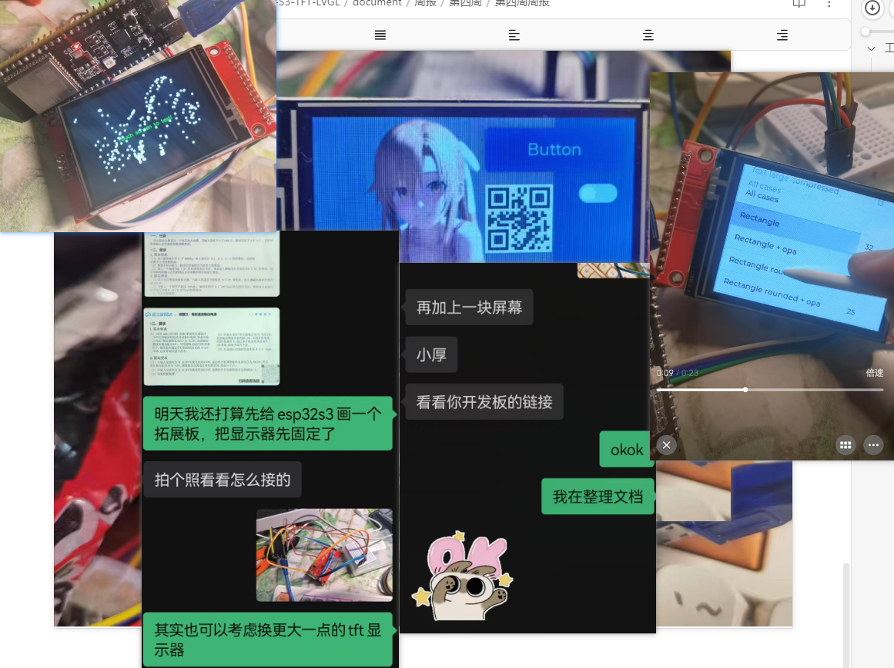
### 2.29-3.5
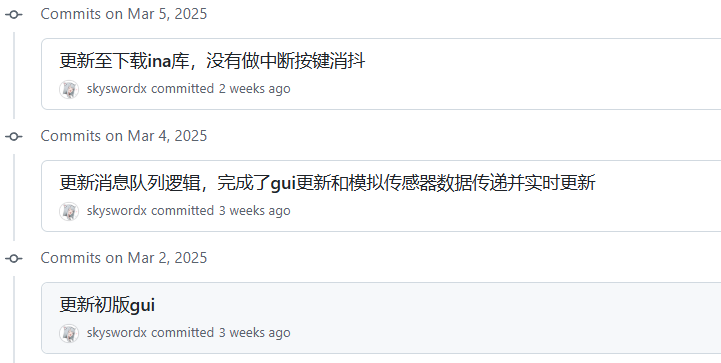
这几天我参考了开源工程电子负载应该要显示的 GUI 界面，不断迭代设计，利用第三方设计工具 GUI-guider 优化我们的 GUI 界面
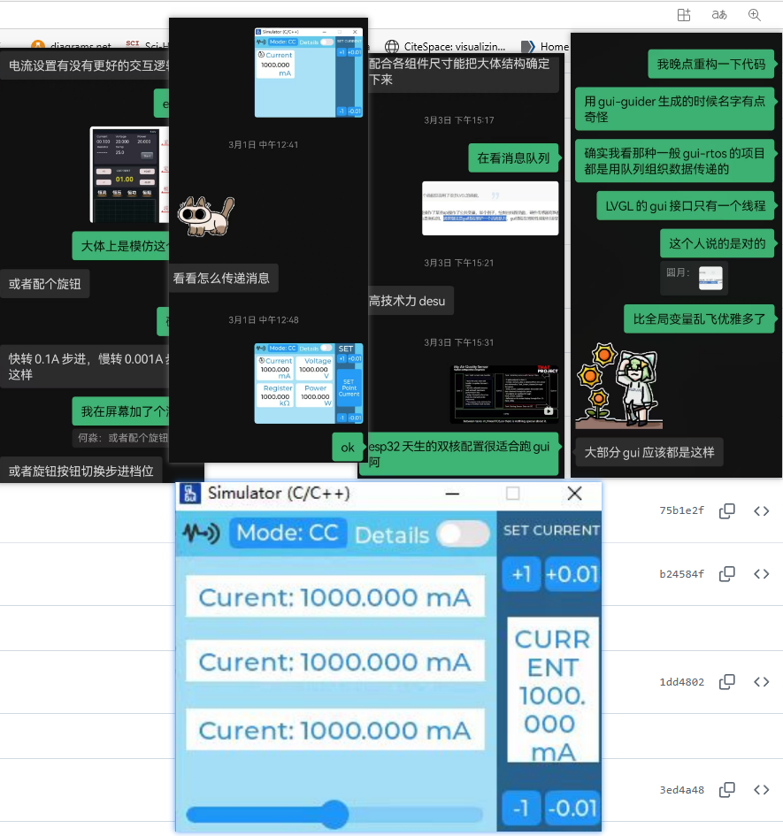

最终的初版 GUI 效果如下
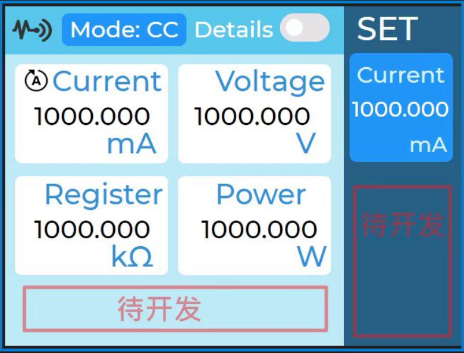

然后还参考我网上优秀的开源工程双核 RTOS 项目，进**一步地规划多任务和 GUI 显示要具体使用的硬件资源规划**

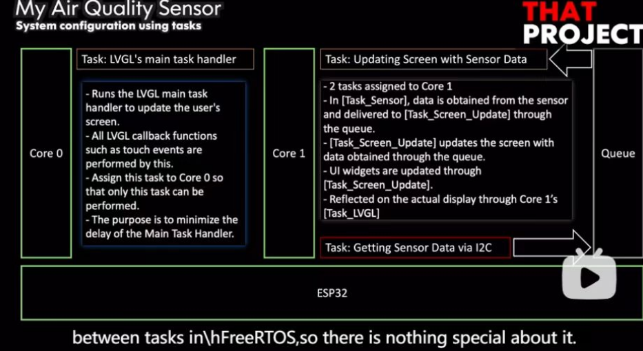

这里主要**我负责的工作是学习 RTOS 的消息队列通信机制**，怎么在不同时进行的任务之间使用队列这种缓冲数据结构进行数据的传递

然后初步实现了一个数据传递仿真。就说用随机数生成器任务来模拟实际上传感器采集任务得到的采样数据，然后通过数据进行发送

同时考虑到触摸屏交互的不方便，设置了一个计数器读取任务来读取旋转编码器的值来调节设定电流值

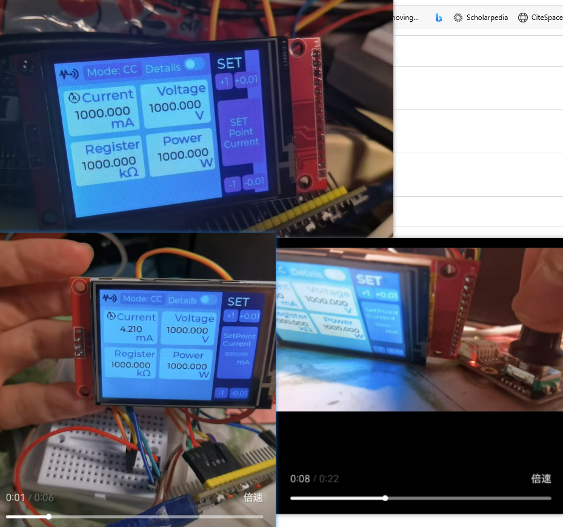

然后我们还收集了开源的 3D 模型，初步估算我们各个组件的大小，试着设计一个合理的空间结构作为初版产品
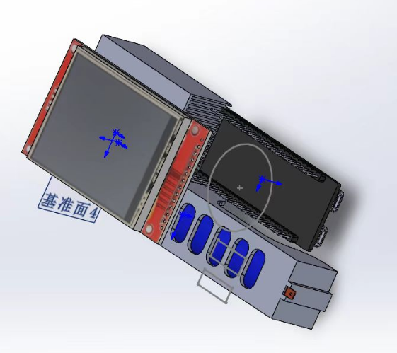

### 3.6-3.13

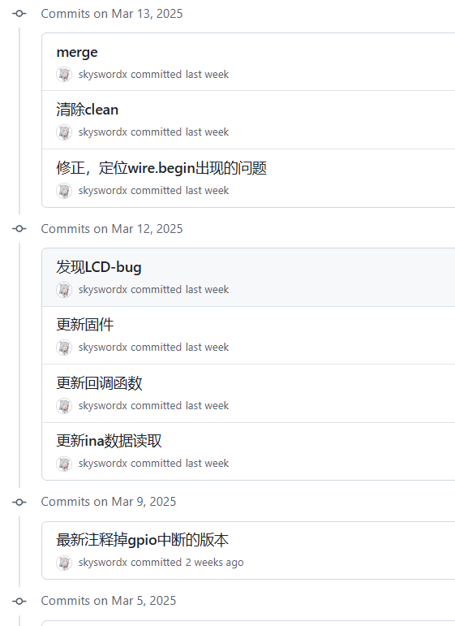

**这几天首先是实现了一组 RTOS 按键中断**，然后使用旋转编码器自带的按键进行测试
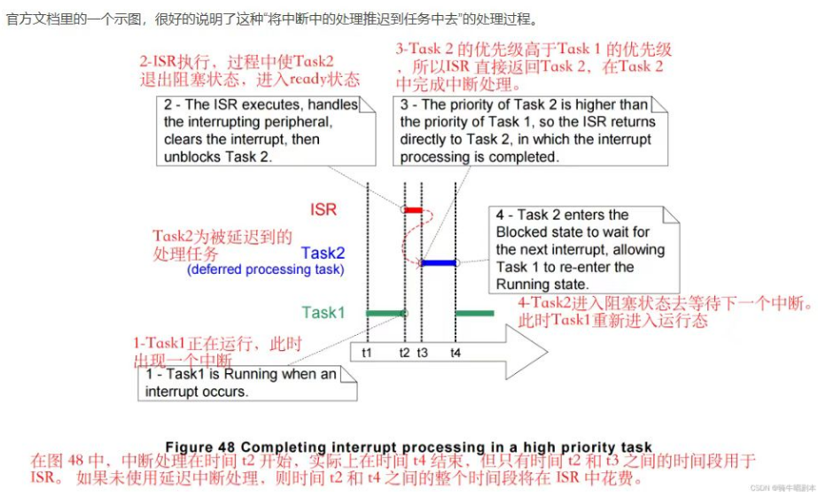

然后我的搭档打板的第一版控制板到了，于是我焊接上对应的排针和排母更方便地调试

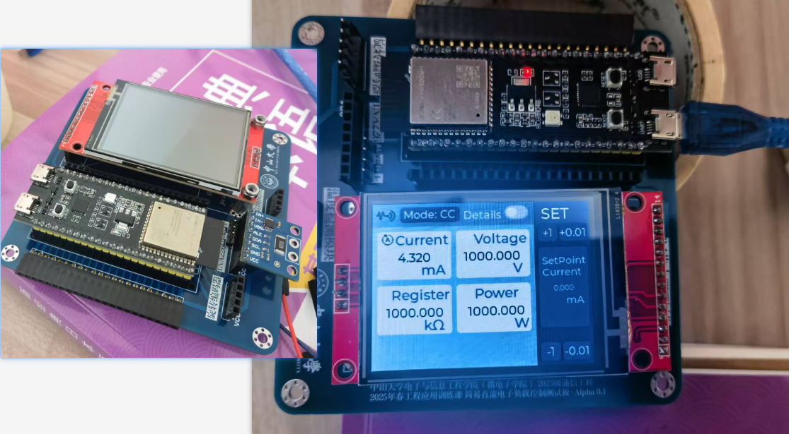

**但是之后我的软件开发出现很多 Bug，所以主要是在解决很多 BUG，于是在仓库新建了一个 DeBug 分支进行调试，调试完解决之后进行 merge 合并**

**旋转编码器的 Bug**
- 一开始是因为我用的旋转编码器自带一个按键，可以按下去，于是就没用独立的按键，想着为这个按键写一组按键处理中断和消抖任务即可，我严格参考了 RTOS 官方的中断任务时序图以及时序逻辑进行编写，可是结果总是不尽人意
- **在解决这个 Bug 的途中，还顺带发现了一些与之无关但是确实存在的 Bug**
- 旋转编码器 VCC 引脚和按键信号引用 pinS（Signal）接反了，导致按下去按键时，MCU 自动 Reset 重启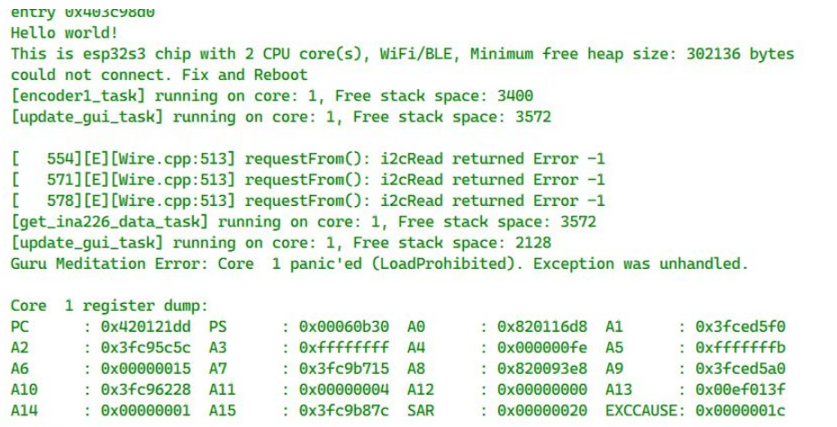

之后排查发现，这个旋转编码器按键中断的 Bug 是，不单单按键按下时，按键引脚会有反应，**在旋转编码器单纯旋转的时候，按键引脚也会电平不稳定**

**串口烧录的 Bug**
- 如果 USB 线插在 USB 口而不是 UART 口进行烧录，就会卡住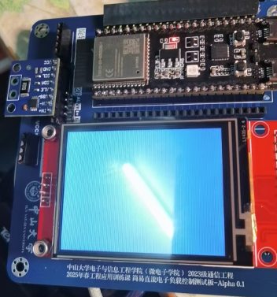

**触摸屏失效的 Bug**
- 猜测是因为在研发的时候，把板子和屏幕没用任何保护直接放书包里磕到了，**没有经验**
- 解决方案，更换屏幕，索性选更大的来提高视觉效果

**IIC 通信的 Bug，无法建立起与 `DAC` 和 `INA226` 的连接，反复触发看门狗重启**
- 之后新建 DeBug 分支，回退版本进行代码对比，发现是引入了初始化 IIC 外设的 `Wire.begin` 出现问题
- 然后查找资料 Debug 半天才发现要指定管脚
- 之后测试了还是不对劲，才发现是串口波特率搞错了

总结这次的 IIC DeBug经验如下
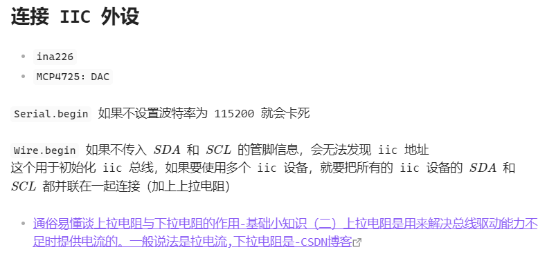

### 3.19-3.21
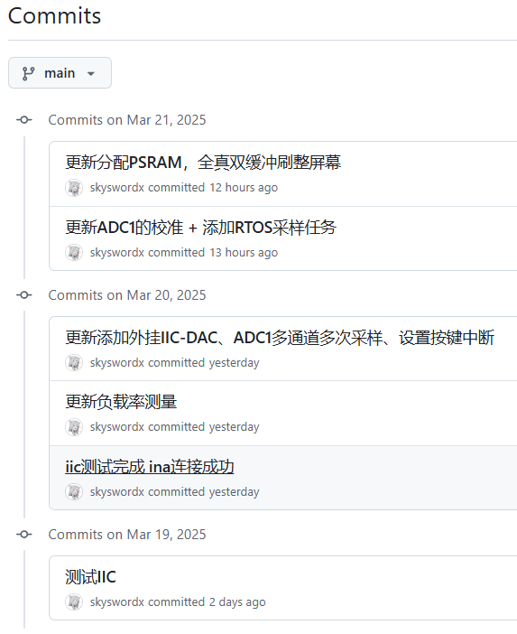

我成功测试了使用 IIC 与 `ina226` 进行通信，并等待功率板进行校准
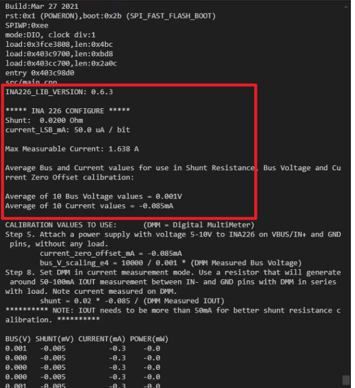

同时调通 `ESP32S3` 的 `ADC1` 多通道连续多次采样，并自动根据内部电压基准源进行校准
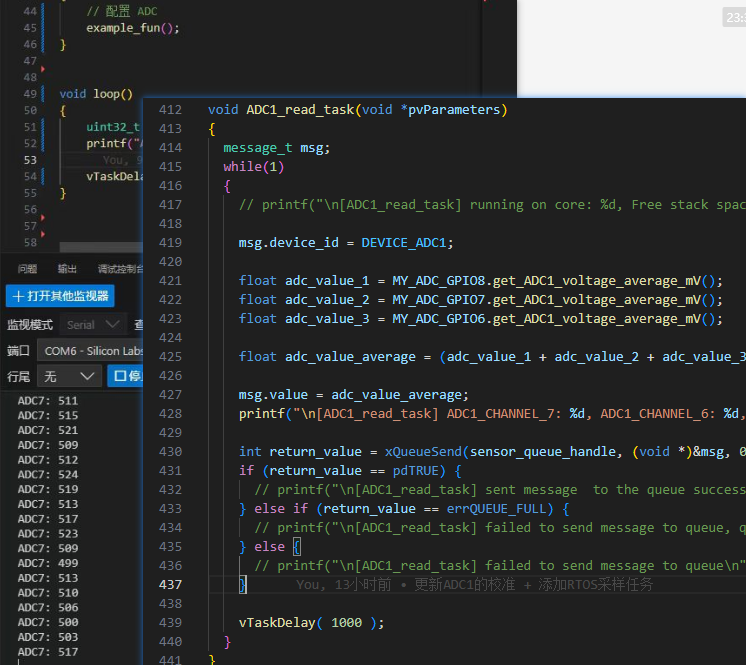

还利用 RTOS 二值信号量阻塞机制，设置了一个过压保护任务，一旦 `ina226` 检测到电压超过 18 V 就会触发保护任务，关闭 DAC 输出保护功率板的元件（这里我使用了按键中断作为触发源来模拟过压）
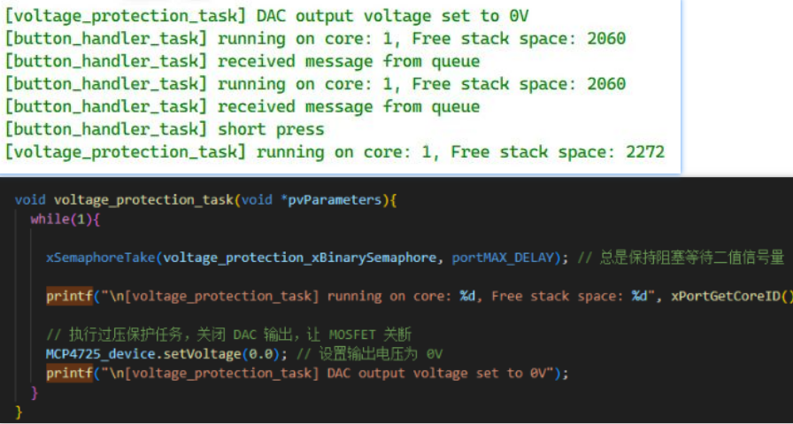

为了应对大屏提高 LVGL 帧率，用空间换时间，把整个屏幕缓冲区数组存到外挂的 PSRAM 上面，因为外挂的 PSRAM 使用的接线是 Optical SPI，总线速率也很快
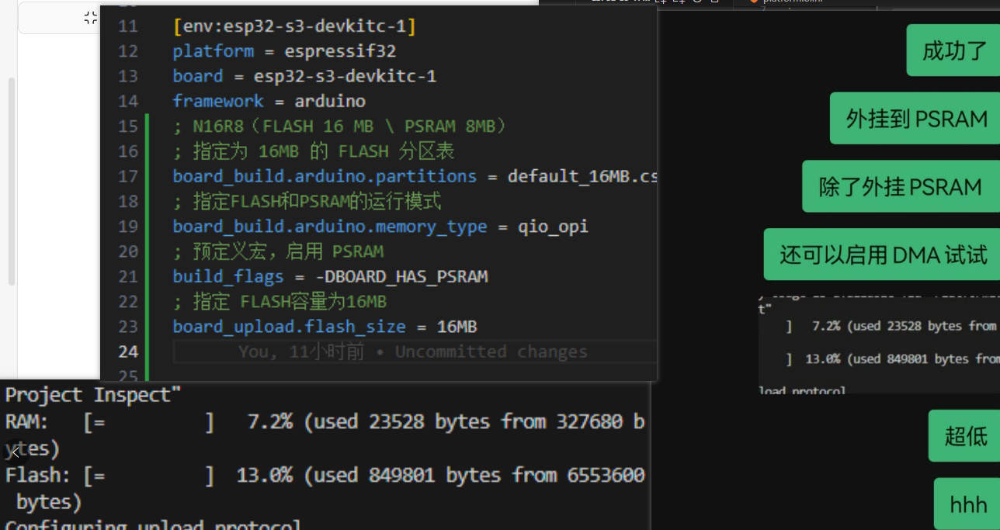
并且把在配置过程中的一些关键点进行了复盘总结。最终达到的 480 x 320 大屏 LVGL 帧率稳定在 50 fps
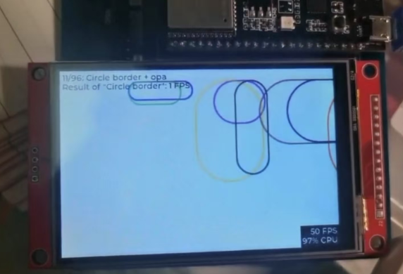

把这些都添加进 RTOS 中的任务框架中（目前构建数据传输链条还是使用小屏）
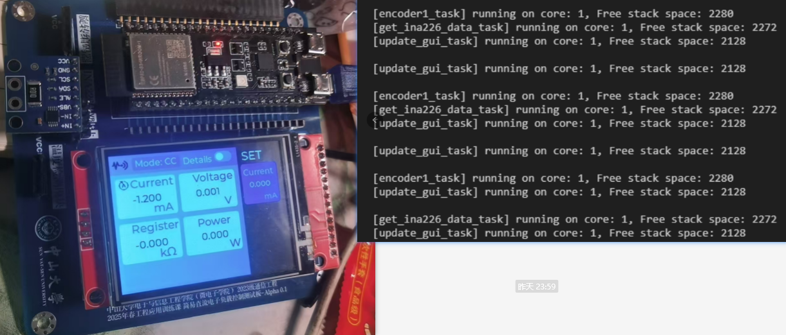

## 3. 未来计划

在硬件功率板打板测试之后，使用 PID 闭环控制 DAC 输出电压给 MOS 管来达到更加精准的恒流效果

